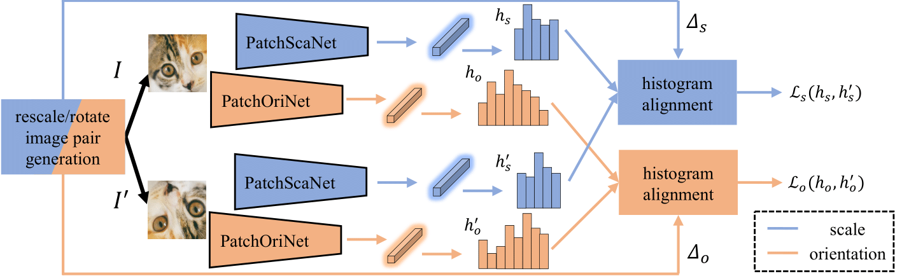
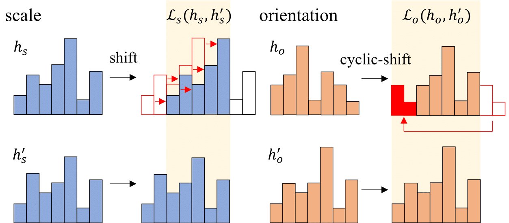

# Self-Supervised Learning of Image Scale and Orientation Estimation (BMVC 2021)


***
</img>
***

This is the official implementation of the paper "Self-Supervised Learning of Image Scale and Orientation Estimation" by Jongmin Lee [[Google Scholar]](https://scholar.google.com/citations?user=WVVqJX8AAAAJ&hl=en), [Yoonwoo Jeong](https://jeongyw12382.github.io) [[Google Scholar]](https://scholar.google.com/citations?user=HQ1PMggAAAAJ&hl=en), and [Minsh Cho](http://cvlab.postech.ac.kr/~mcho/) [[Google Scholar]](https://scholar.google.com/citations?user=5TyoF5QAAAAJ&hl=en&oi=ao). 
We introduce a self-supervised framework for learning patch pose. Given a rescaled/rotated pair of image patches, we feed them to the patch pose estimation networks that output scale/orientation histograms for each. We compare the output histogram vectors by the histogram alignment technique and compute the loss. 


## Requirements

* Ubuntu 18.04
* python 3.8
* pytorch 1.8.1
* torchvision 0.9.1
* wandb 0.10.28

## Environment

#### Clone the Git repository
```bash
git clone https://github.com/bluedream1121/SelfScaOri.git
```

#### Install dependency
Run the script to install all the dependencies.  You need to provide the conda install path (e.g. ~/anaconda3) and the name for the created conda environment.

```bashd
bash install.sh conda_install_path self-sca-ori
```

## Dataset preparation

You can download the training/test dataset using the following scripts:

```bash
cd datasets
bash download.sh
```

If you want to regenerate the patchPose datasets, please run the following script:

```bash
cd datasets/patchpose_dataset_generation
bash generation_script.sh
```

## Trained models

```bash
cd trained_models
bash download_ori_model.sh
bash download_sca_model.sh
```

## Test on the patchPose and the HPatches
After download the datasets and the pre-trained models, you can evaluate the patch pose estimation results using the following scripts:

```bash
python test.py --load trained_models/_*branchori/best_model.pt  --dataset_type ppa_ppb
python test.py --load trained_models/_*branchsca/best_model.pt  --dataset_type ppa_ppb

python test.py --load trained_models/_*branchori/best_model.pt  --dataset_type hpa
python test.py --load trained_models/_*branchsca/best_model.pt  --dataset_type hpa
```

## Training 

***
<p align="center">
</img>
</p>

***

You can train the networks for patch scale estimation and orientation estimation using the proposed histogram alignment loss as follows:

```bash
python train.py --branch ori --output_ori 36

python train.py --branch sca --output_sca 13
```


## Citation
If you find our code or paper useful to your research work, please consider citing our work using the following bibtex:
```
@inproceedings{lee2021self,
  title={Self-Supervised Learning of Image Scale and Orientation},
  author={Lee, Jongmin and Jeong, Yoonwoo and Cho, Minsu },
  booktitle     = {31st British Machine Vision Conference 2021, {BMVC} 2021, Virtual Event, UK},
  publisher = {{BMVA} Press},
  year      = {2021},
  url       = {https://www.bmvc2021-virtualconference.com/programme/accepted-papers/},
}
```

## Contact

Jongmin Lee (ljm1121@postech.ac.kr)

Questions can also be left as issues in the repository. 

